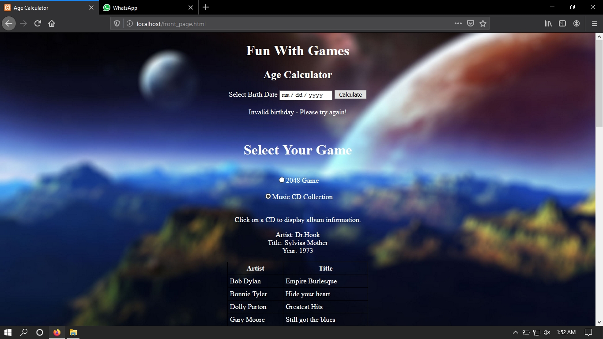
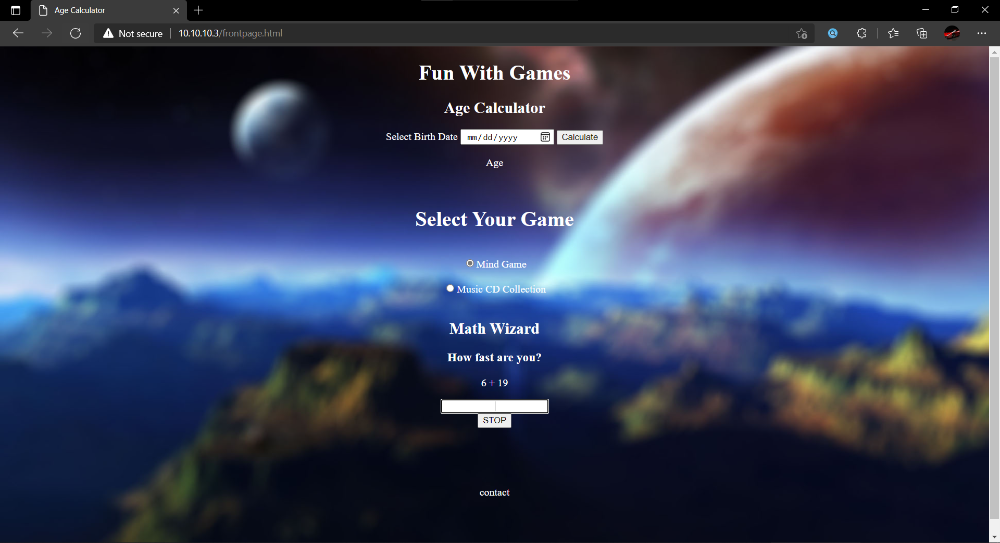

# Project Age Calculator And Games

| Project Title : **Project Age Calculator And Games** |
--------

This was my first **Web based** project made for somenoes university project. The tools used in this project are **HTML**, **CSS** and **Javascript**. This project was mainly aimed to access **Javascript** abilities by using it to solve various problems.

### It consistss of

* **age calculator**, m
* A **Math Wizard** game
* A **CD collections** section

### The role of

* **Age Calculator** was to see the time based algorithm implementation skills
* **Math Wizard** was to access the math based algorithm implementation skills
* **CD Collections** was meant to test the AJAX implementation abilities

## Screenshots

